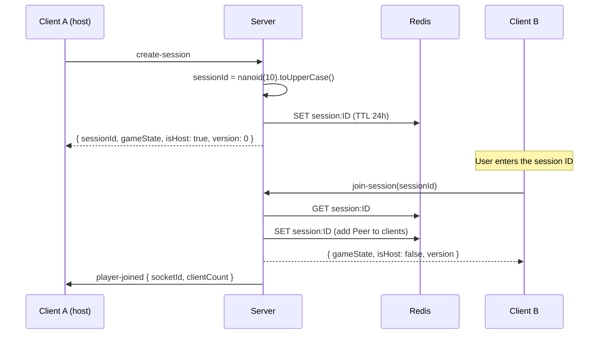
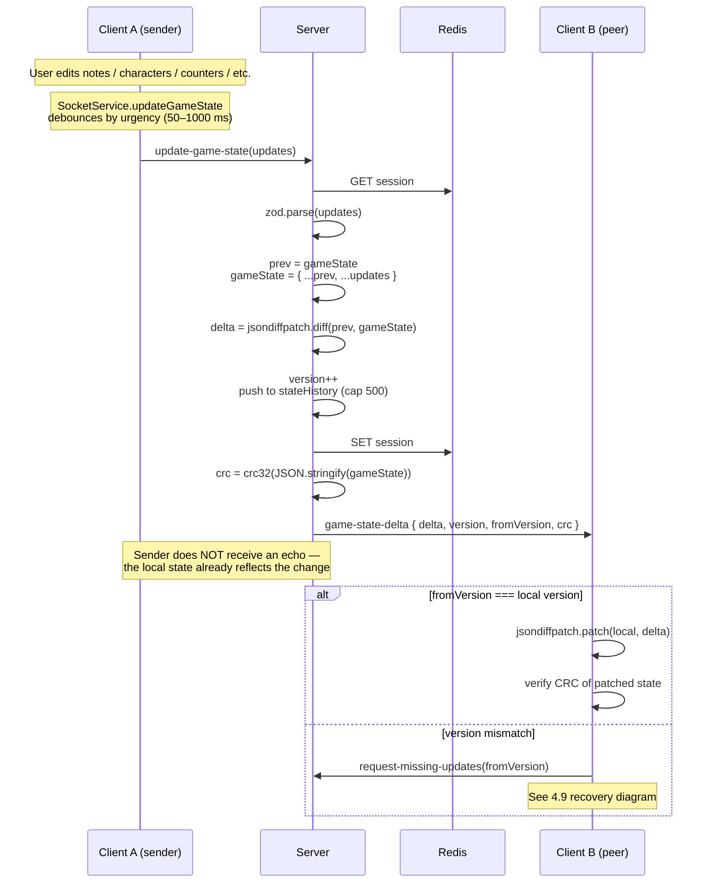
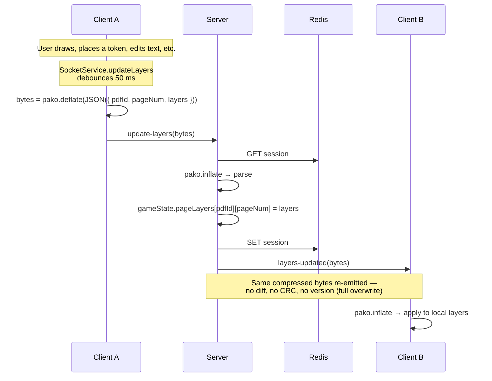
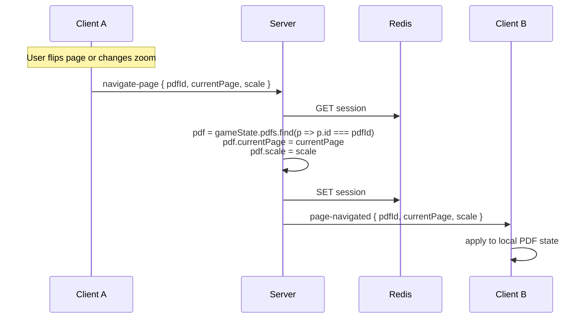
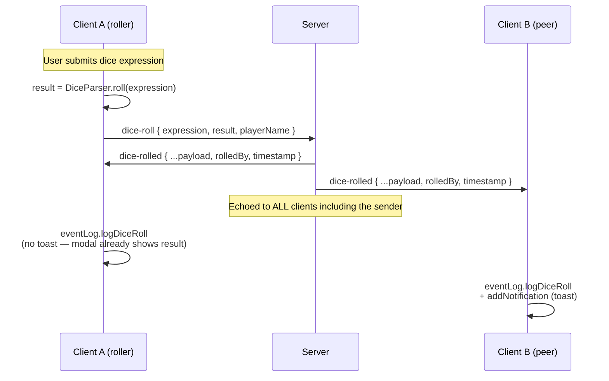
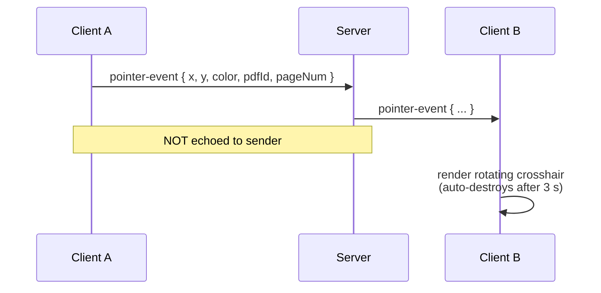
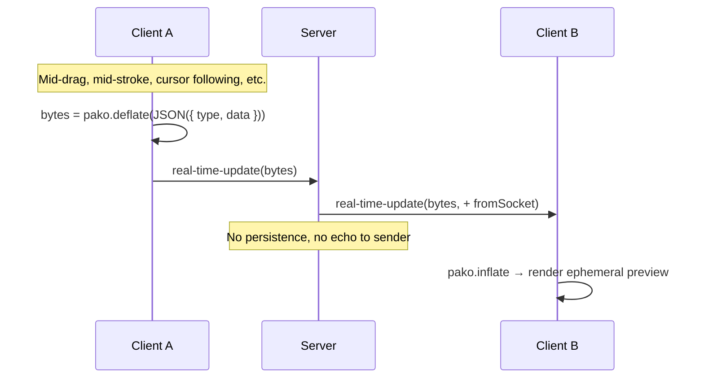
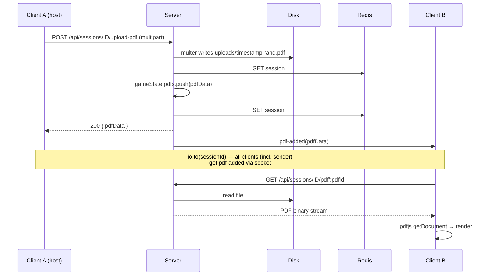
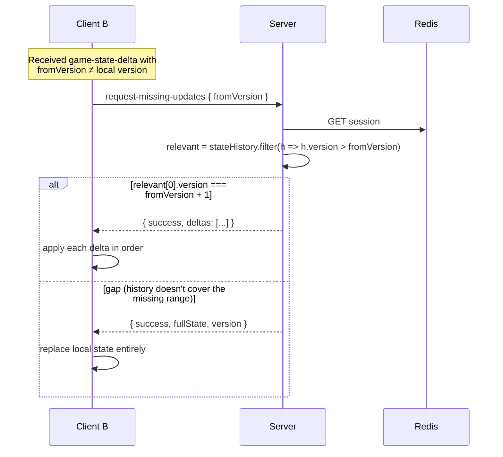

## Gamebook Studio: Multiplayer State Exchange Specification

This document outlines the real-time multiplayer state synchronization mechanism used in Gamebook Studio. It covers the overall architecture, the data exchanged between the client and server, and the failure recovery process.

### 1. How It Works: The Synchronization Flow

The multiplayer functionality is built on a client-server architecture using **Socket.IO**. The server maintains the authoritative game state for each session, and clients send updates to the server, which then broadcasts them to other clients in the session.

Here’s a step-by-step overview of the process:

1.  **Session Creation/Joining**: A user either creates a new session or joins an existing one using a session ID. The server creates a `GameSession` object to hold the state for that session.

2.  **Initial State Sync**: When a new client joins, the server sends them the complete, current game state to ensure they are synchronized with the other players.

3.  **Client-Side Updates**: When a player performs an action (e.g., moves a token, updates a character sheet), the client-side `SocketService` sends an update to the server. These updates are debounced based on the type of action to avoid sending excessive messages.

4.  **Server-Side State Update**: The server receives the update and applies it to the `GameSession`'s state. It then calculates a "delta" (the difference between the old and new state) using the `jsondiffpatch` library.

5.  **Broadcasting Deltas**: Instead of sending the entire game state to all clients, the server broadcasts only the delta. This is highly efficient as it minimizes the amount of data transmitted.

6.  **Client-Side Patching**: Other clients in the session receive the delta and apply it to their local game state, bringing them in sync with the player who made the change.

### 2. What It Exchanges: Data and Events

The communication between the client and server is event-driven. Here are the key events and the data they carry:

| Event Name              | Direction       | Data Exchanged                                                                                                                                                              | Description                                                                                                                                                                                                                                                          |
| ----------------------- | --------------- | --------------------------------------------------------------------------------------------------------------------------------------------------------------------------- | -------------------------------------------------------------------------------------------------------------------------------------------------------------------------------------------------------------------------------------------------------------------- |
| `create-session`        | Client to Server | None                                                                                                                                                                        | A client requests to create a new multiplayer session.                                                                                                                                                                                                           |
| `join-session`          | Client to Server | `sessionId` (String)                                                                                                                                                        | A client requests to join an existing session.                                                                                                                                                                                                                  |
| `update-game-state`     | Client to Server | `updates` (Object)                                                                                                                                                          | The client sends a partial game state object containing the changes made by the user (e.g., updated `characters`, `notes`, or `counters` arrays).                                                                                                           |
| `game-state-delta`      | Server to Client | `{ delta, version, fromVersion, crc }` (Object)                                                                                                                             | The server broadcasts the calculated delta, the new state version, the previous version, and a CRC32 checksum of the full game state. The client uses this to patch its local state.                                                                        |
| `update-layers`         | Client to Server | Compressed data (using `pako`) containing `{ pdfId, pageNum, layers }`                                                                                                      | For annotations like drawings and tokens, the client sends the entire layer data for a specific page, compressed to save bandwidth.                                                                                                                          |
| `layers-updated`        | Server to Client | Compressed layer data                                                                                                                                                       | The server broadcasts the compressed layer data to other clients.                                                                                                                                                                                               |
| `real-time-update`      | Client to Server, Server to Client | Compressed data containing `{ type, data }`                                                                                                                               | Used for transient updates that don't need to be stored in the main state, such as showing a drawing in progress or a pointer moving across the screen. The server immediately broadcasts this to other clients without storing it.               |
| `navigate-page`         | Client to Server | `{ pdfId, currentPage, scale }` (Object)                                                                                                                                    | When a user navigates to a different page or zooms, this event is sent to the server.                                                                                                                                                                         |
| `page-navigated`        | Server to Client | `{ pdfId, currentPage, scale }` (Object)                                                                                                                                    | The server broadcasts the page navigation event to all other clients.                                                                                                                                                                                           |
| `upload-pdf`            | Client to Server | PDF file and metadata (via HTTP POST, not Socket.IO)                                                                                                                        | The host of a session can upload a PDF, which is then stored on the server.                                                                                                                                                                                          |
| `pdf-added`             | Server to Client | `pdfData` (Object)                                                                                                                                                          | The server notifies all clients that a new PDF has been added to the session. Clients then fetch the PDF from the server via a separate HTTP request.                                                                                                        |
| `request-missing-updates` | Client to Server | `{ fromVersion }` (Object)                                                                                                                                                  | If a client detects it has missed an update (i.e., the `fromVersion` in a `game-state-delta` event doesn't match its current version), it requests the missing updates from the server.                                                                      |
| `dice-roll`             | Client to Server | `{ expression, result, playerName }` (Object)                                                                                                                               | A player has rolled dice. The client computes the result locally via `DiceParser` and sends it for relay.                                                                                                                                                       |
| `dice-rolled`           | Server to Client | `{ expression, result, playerName, rolledBy, timestamp }` (Object)                                                                                                          | The server echoes the roll to **all** clients including the sender, so every client logs the same canonical entry. Peers also show a toast; the sender skips the toast (the dice modal already shows the result).                                            |
| `pointer-event`         | Client to Server, Server to Client | `{ x, y, color, pdfId, pageNum }` (Object)                                                                                                                                  | Drops a transient crosshair on the PDF. The server relays it to peers only (the sender is not echoed). The peer auto-destroys the marker after ~3 seconds.                                                                                                  |
| `player-joined`         | Server to Client | `{ socketId, clientCount }` (Object)                                                                                                                                        | Notifies existing clients that a new player joined the session.                                                                                                                                                                                                  |
| `player-left`           | Server to Client | `{ socketId, clientCount }` (Object)                                                                                                                                        | Notifies remaining clients that a player disconnected. If the host left and others remain, the server promotes another client and emits `host-changed`.                                                                                                       |
| `host-changed`          | Server to Client | `{ newHostId }` (Object)                                                                                                                                                    | Sent when the previous host disconnects and another client is promoted to host.                                                                                                                                                                                  |

### 3. How It Recovers from Failure

The system has a robust mechanism for handling synchronization issues, such as a client temporarily disconnecting or missing an update packet.

1.  **State Versioning**: Every time the game state is updated, the server increments a `stateVersion` number. This version is sent along with every `game-state-delta`.

2.  **State History**: The server maintains a short history of the most recent state deltas. This allows it to send a series of deltas to a client that has missed a few updates, which is more efficient than sending the entire state again.

3.  **Client-Side Version Check**: When a client receives a `game-state-delta`, it checks if the `fromVersion` in the payload matches its own `gameStateVersion`.
    -   If they **match**, the client applies the delta and increments its local version number.
    -   If they **do not match**, it means the client has missed one or more updates.

4.  **Requesting Missing Updates**: If a version mismatch is detected, the client sends a `request-missing-updates` event to the server, telling the server which version it currently has.

5.  **Server Response**: The server then decides the best way to get the client back in sync:
    -   **If the server has the required deltas in its history**, it sends an array of all the deltas the client has missed. The client can then apply these in order to catch up.
    -   **If the client is too far behind** (i.e., the required deltas are no longer in the server's history), the server sends the **entire current game state** along with the latest version number. This is a fallback to guarantee synchronization, even after a prolonged disconnection.

6.  **Data Integrity with CRC Checksum**: To ensure that the state is perfectly synchronized after an update, the server calculates a **CRC32 checksum** of the new game state and includes it in the `game-state-delta` payload. The client does the same calculation on its end after applying the delta. If the checksums do not match, it indicates a desynchronization issue, and the client can then request a full state update from the server.

### 4. Synchronization Flow Diagrams

The sections below show each sync path as a sequence diagram. The patterns differ by intent: **game state** uses versioned diffs with a CRC, **layers** use compressed full-overwrites without versioning, **real-time** events are fire-and-forget, and **dice rolls** are explicitly echoed to the sender too (so all clients log the same canonical roll).

#### 4.1 Session lifecycle (create / join)

#### 4.2 Game state delta (notes, characters, counters, PDFs metadata)

#### 4.3 Layer updates (drawings, tokens, text on canvas)

#### 4.4 Page navigation (page change, zoom)

#### 4.5 Dice roll

#### 4.6 Pointer event (transient crosshair on PDF)

#### 4.7 Real-time update (preview while dragging / drawing)

#### 4.8 PDF upload and propagation

#### 4.9 Recovery: request-missing-updates

